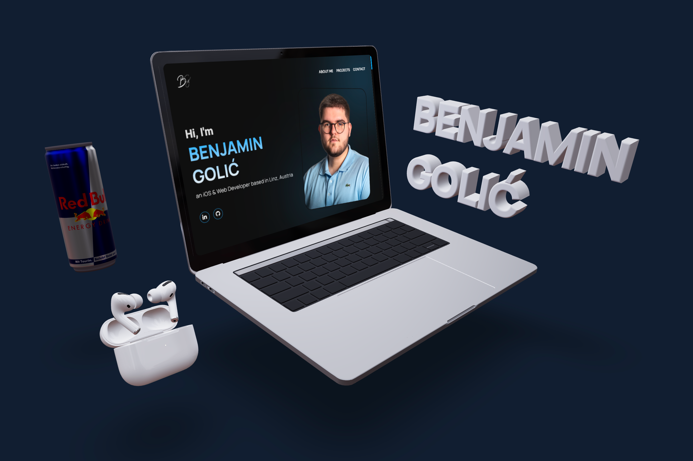
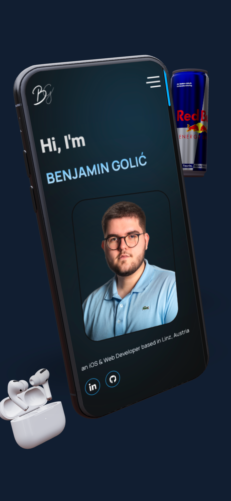

# ThreeJS 3D Portfolio-Showcase
## 🎨 About the Project

This project is part of the [Three.js Journey](https://threejs-journey.com/) course. It features an interactive 3D experience showcasing both desktop and mobile-optimized versions of my portfolio. For desktop users, the project displays a 3D model of a MacBook, while mobile users will see a 3D model of an iPhone. The experience is further enriched by additional 3D models, including a RedBull can and AirPods Pro. Each device model adapts to the user's screen size and displays an embedded version of my personal portfolio.

## 🚀 Explore the Project:

- **Experience the live 3D showcase**: Explore the [Live Demo](https://benjamingolic.github.io/threejs-3d-portfolio-showcase/).
- **Visit my portfolio**: For a deeper dive into my work, head over to my [personal portfolio](https://www.golic.at).

## 🖼️ Preview

- **Desktop Version:**

  

- **Mobile Version:**

  

## 🛠️ Technologies Used

- [Three.js](https://threejs.org/) – 3D rendering library
- [GLTFLoader](https://threejs.org/docs/#examples/en/loaders/GLTFLoader) – To load 3D models (MacBook, iPhone)
- [Vite](https://vitejs.dev/) – Fast build tool for modern web projects
- [HTML & CSS](https://developer.mozilla.org/en-US/docs/Web/HTML) – For building the portfolio layout
- [GitHub Pages](https://pages.github.com/) – To host the project

## 🎯 Features

- **MacBook Version:**
  - 3D interactive MacBook model
  - Embedded iFrame that showcases a personal portfolio for desktop
  - Smooth animations and lighting effects
  
- **iPhone Version:**
  - 3D interactive iPhone model 
  - Portfolio optimized for mobile devices, ensuring a responsive and clean presentation

- **Additional 3D Models:**
  - **RedBull 3D Model:**  A nod to my coding routine, this 3D RedBull can is a visual tribute to one of my go-to essentials while working long hours on projects.
  - **AirPods Pro 3D Model:** Representing my focus tool, the AirPods Pro 3D model highlights the gear that keeps me in the zone during deep work sessions.

## 🛠️ Running the Project Locally

Follow these simple steps to get the project up and running on your local machine:

1. **Clone the repository**:
   ```bash
   git clone https://github.com/benjamingolic/threejs-3d-portfolio-showcase.git
   ```
2. **Navigate into the project directory:**
    ```bash
    cd threejs-3d-portfolio-showcase
    ```
3. **Install the required dependencies:** Make sure you have [Node.js](https://nodejs.org/en) installed, then run:
    ```bash
    npm install
    ```
4. **Start the development server:** Once the dependencies are installed, start the development server with Vite:
    ```bash
    npm run dev
    ```

## 💡 Acknowledgements

- [Three.js Journey](https://threejs-journey.com/) for the amazing course content.
- [Three.js Documentation](https://threejs.org/docs/) for comprehensive Three.js resources.
